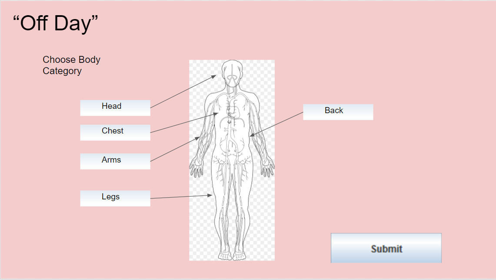
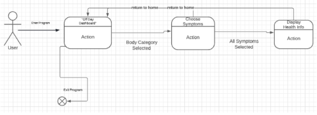
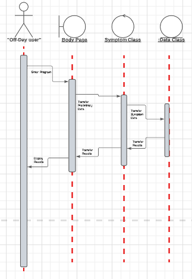

Protype 2 Design: In This design I focused on implementing and creating my database tables as well implementing inserts, deletes, and searches for the database.
I began to create my user diagram and I implemented basic pages.

Welcome to OFF-DAY!

This Program allows a person to input various "off" feeling symptoms and it will produce a quick and easy diagnoses!

Users will first select a body category where they are feeling symptomatic. They will then choose from a list a symptoms and after choosing their symptoms, they will be redirected to a page that displays the correct safety measures to do in response to feeling this symptom.

The goal of this tool is to be a simple, quick and easy way to self-diagnose "off" symptoms in order to prevent medical accidents and other related issues. 
=======================================================================================================================================================================
Installation:

This Project requires the installation of Ruby version 3.0.2 and Rails Version 6.0.4.7 

For Linux/Ubuntu: 

sudo apt-get update

sudo apt-get install git-core curl zlib1g-dev build-essential libssl-dev libreadline-dev libyaml-dev libsqlite3-dev sqlite3 libxml2-dev libxslt1-dev libcurl4-openssl-dev software-properties-common libffi-dev

gem install bundler

gem install rails -v 6.0.4.7

This Project was built with Linux and works best on a Linux distribution. For Windows users, they can 
install the ruby installer via https://rubyinstaller.org/ , and then running: gem install rails

This program was tested on both a sophisticated Desktop machine and a small laptop and there were no performance issues in either of these.

Once the Program is succesfully started, Navigate to the /home/student1/vm-csc415/assignment2/assignment2/Off-Day/src and run

rails s --binding= [INSERT SERVER IP HERE]

Note: the user will replace [INSERT SERVER IP HERE] with their host server ip address.

