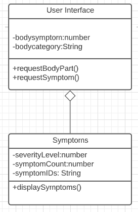

Welcome to OFF-DAY!

This Program allows a person to input various "off" feeling symptoms and it will produce a quick and easy diagnoses!

Users will first select a body category where they are feeling symptomatic. They will then choose from a list a symptoms and after choosing their symptoms, they will be redirected to a page that displays the correct safety measures to do in response to feeling this symptom.

The goal of this tool is to be a simple, quick and easy way to self-diagnose "off" symptoms in order to prevent medical accidents and other related issues. 

